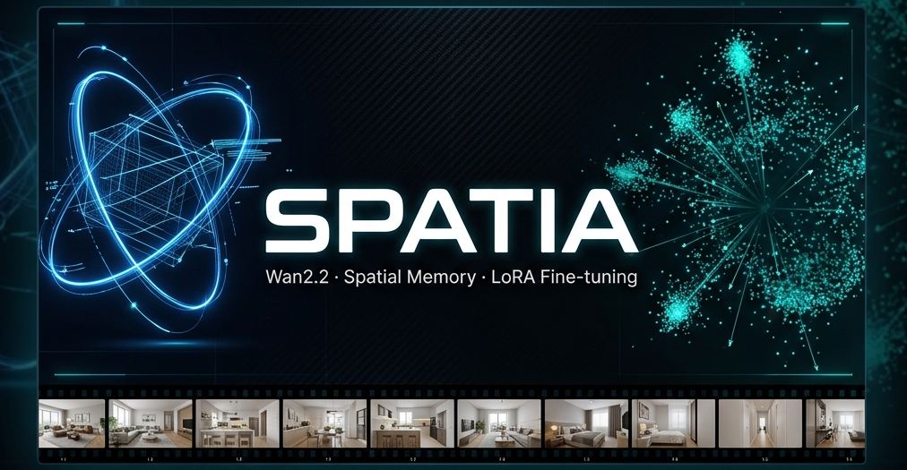
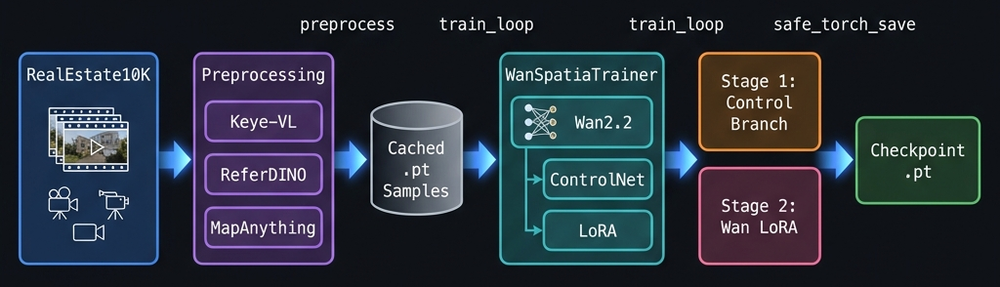
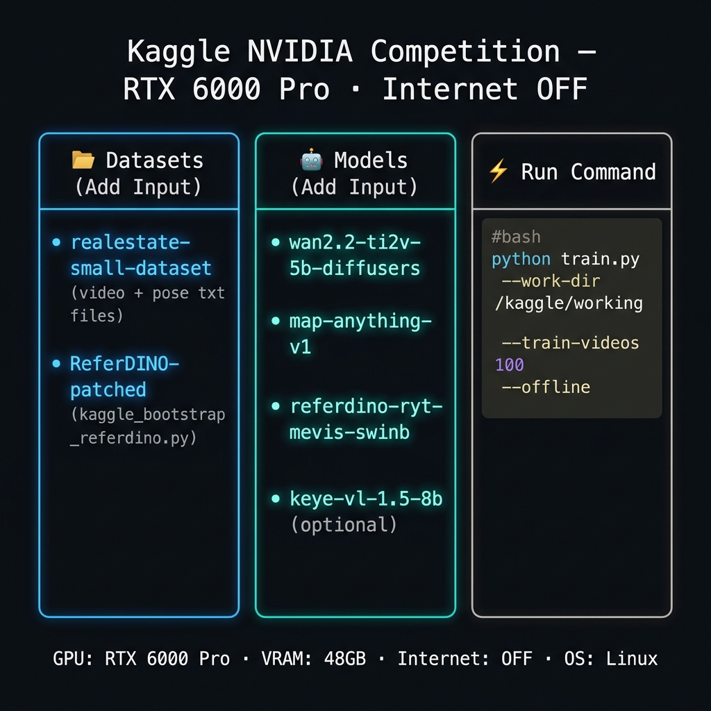

# Spatia — Wan2.2 Spatial Memory Training Pipeline

> **WorldScore paper-aligned** · Wan2.2 backbone · LatentSpatiaControlNet · LoRA fine-tuning · RealEstate10K



Pipeline training model **Spatia** gồm:
- **RealEstate10K** — video + camera pose (RealEstate10K format)
-  **ReferDINO** — dynamic object masks (optical flow fallback)
-  **MapAnything** — depth maps + spatial memory (fallback: texture-based depth)
-  **Wan2.2** — video diffusion backbone (frozen) với ControlNet branch + LoRA
-  **Keye-VL** — scene description (tuỳ chọn)


## Cấu trúc project

```
Spatia/
├── source/
│   ├── train.py                    ← Entry point chính
│   ├── download_assets.py          ← Tải models về máy có Internet
│   ├── requirements.txt
│   └── spatia_pipeline/
│       ├── config.py               ← SpatiaConfig — toàn bộ hyperparameters
│       ├── args.py                 ← CLI arguments
│       ├── runner.py               ← Orchestrator (không dùng exec)
│       ├── setup/                  ← Kiểm tra dependencies, offline shims
│       ├── assets/                 ← Auto-detect model paths (Kaggle/local)
│       ├── data/                   ← manifest, video_utils, dataset
│       ├── preprocessing/          ← Keye-VL, ReferDINO, MapAnything
│       ├── model/                  ← LatentSpatiaControlNet, WanSpatiaTrainer
│       ├── training/               ← train_loop, checkpoint, evaluate
│       └── evaluation/             ← PSNR, SSIM, LPIPS, benchmark
└── docs/images/                    ← Tài liệu ảnh
```

---

## Phần 1 — Chạy trên máy có Internet (Local / Colab / RunPod)

### 1.1. Cài môi trường

```bash
python -m venv .venv
source .venv/bin/activate          # Windows: .venv\Scripts\activate

pip install -U pip setuptools wheel
pip install torch torchvision torchaudio --index-url https://download.pytorch.org/whl/cu121
pip install -r source/requirements.txt
```

### 1.2. Tải assets về máy

```bash
python source/download_assets.py --assets-dir ./assets
```

Script này tải:
- **Wan2.2** diffusers model → `assets/models/wan2.2-ti2v-5b-diffusers/`
- **ReferDINO** repo + checkpoint → `assets/repos/ReferDINO/` + `assets/checkpoints/referdino/ryt_mevis_swinb.pth`
- **MapAnything** repo + model → `assets/repos/map-anything/` + `assets/models/map-anything/`
- **Keye-VL** model (tuỳ chọn) → `assets/models/keye-vl-1.5-8b/`

Build GroundingDINO CUDA ops (cần một lần):

```bash
cd assets/repos/ReferDINO/models/GroundingDINO/ops
python setup.py build_ext --inplace
cd -
```

### 1.3. Chuẩn bị dataset RealEstate10K

```text
# Cách 1 — video / poses tách folder
data/realestate10k/
├── videos/  (*.mp4)
└── poses/   (*.txt, RealEstate10K format)

# Cách 2 — cùng folder
data/realestate10k/
├── 000001.mp4
├── 000001.txt
└── ...
```

> Nhiều link YouTube trong RealEstate10K đã bị xóa. Chuẩn bị **dư 2× số video cần**.

### 1.4. Chạy training

```bash
# Full pipeline (preprocess + stage1 + stage2)
python source/train.py \
  --assets-dir ./assets \
  --data-root ./data/realestate10k \
  --work-dir ./outputs \
  --train-videos 100 \
  --test-videos 20 \
  --stage both

# Chỉ preprocess
python source/train.py --assets-dir ./assets --data-root ./data/realestate10k --preprocess-only

# Với benchmark và sample video
python source/train.py --assets-dir ./assets --data-root ./data/realestate10k \
  --run-benchmark --save-sample --audit
```

---

## Phần 2 — Chạy trên Kaggle (NVIDIA Competition · RTX 6000 Pro · Internet OFF)



### 2.1. Điều kiện

- Tham gia **NVIDIA competition** trên Kaggle — GPU **RTX 6000 Pro (95 GB VRAM)**
- **Internet bị tắt** trong khi notebook chạy
- Toàn bộ model / data phải được upload trước qua **Add Input**

### 2.2. Các input cần add vào Kaggle Notebook

Vào **Edit → Add Input** trong notebook và thêm đủ các mục sau:

#### Datasets

| Slug / Tên dataset | Nội dung | Mount path |
|---|---|---|
| `realestate-small-dataset` | Video `.mp4` + pose `.txt` (RealEstate10K format) | `/kaggle/input/realestate-small-dataset/` |
| `referdino-patched` | ReferDINO repo đã patch (có file `kaggle_bootstrap_referdino.py`) | `/kaggle/input/referdino-patched/` |

#### Models

| Handle / Slug | Nội dung | Mount path |
|---|---|---|
| `<owner>/wan2-ti2v-5b-diffusers/pytorch/default` | Wan2.2 diffusers format — phải có `model_index.json` | `/kaggle/input/models/<owner>/wan2-ti2v-5b-diffusers/pytorch/default/1/` |
| `<owner>/map-anything-v1/pytorch/default` | MapAnything model directory | `/kaggle/input/models/<owner>/map-anything-v1/pytorch/default/1/Map-anything-v1/` |
| `<owner>/referdino-ryt-mevis-swinb/pytorch/default` | ReferDINO checkpoint `ryt_mevis_swinb.pth` | `/kaggle/input/models/<owner>/referdino-ryt-mevis-swinb/pytorch/default/1/` |
| `<owner>/keye-vl-1-5-8b/pytorch/default` | Keye-VL model *(tuỳ chọn)* | `/kaggle/input/models/<owner>/keye-vl-1-5-8b/pytorch/default/1/` |

> Pipeline **tự động tìm kiếm** toàn bộ `/kaggle/input/` — không cần truyền path thủ công nếu slug chứa keyword phù hợp (`wan`, `referdino`, `map-anything`, `keye`).

### 2.3. Upload source code

Trong Kaggle Notebook cell đầu:

```bash
# Option A — Upload qua Kaggle Dataset
# Tạo dataset từ thư mục source/, mount vào /kaggle/input/spatia-source/

# Option B — Clone trực tiếp (nếu có Internet)
# git clone https://github.com/<your-repo>/spatia /kaggle/working/source
```

Hoặc copy thẳng vào `/kaggle/working/`:

```python
import shutil, os
shutil.copytree("/kaggle/input/spatia-source/source", "/kaggle/working/source")
os.chdir("/kaggle/working")
```

### 2.4. Chạy training

```bash
python /kaggle/working/source/train.py \
  --work-dir /kaggle/working \
  --train-videos 100 \
  --test-videos 20 \
  --stage both \
  --offline
```

Pipeline sẽ **tự detect** toàn bộ path từ `/kaggle/input/`. Nếu muốn chỉ định thủ công:

```bash
python /kaggle/working/source/train.py \
  --data-root /kaggle/input/realestate-small-dataset \
  --wan-model /kaggle/input/models/<owner>/wan2-ti2v-5b-diffusers/pytorch/default/1 \
  --referdino-repo /kaggle/input/referdino-patched \
  --referdino-ckpt /kaggle/input/models/<owner>/referdino-ryt-mevis-swinb/pytorch/default/1/ryt_mevis_swinb.pth \
  --mapanything-repo /kaggle/input/referdino-patched \
  --mapanything-model /kaggle/input/models/<owner>/map-anything-v1/pytorch/default/1/Map-anything-v1 \
  --work-dir /kaggle/working \
  --train-videos 100 \
  --offline
```

### 2.5. Output sau khi chạy

```text
/kaggle/working/
├── processed_spatia_full_<run_tag>/
│   └── *.pt                                    ← Cached preprocessed samples
├── spatia_full_checkpoints_<run_tag>/
│   ├── stage1_step_*_wan_trainable.pt
│   ├── stage2_step_*_wan_trainable.pt
│   ├── spatia_wan2_trainable_delta_final.pt    ← Checkpoint cuối (submit)
│   ├── spatia_wan2_config.json
│   ├── benchmark_results.csv                   ← Nếu --run-benchmark
│   └── benchmark_summary.json
└── spatia_full_samples_<run_tag>/
    └── wan_spatia_reconstruction.mp4           ← Nếu --save-sample
```

### 2.6. Kiểm tra sample đã preprocess

```python
import torch

sample = torch.load("processed_spatia_full_xxx/000001.pt", map_location="cpu")
print(sample.keys())
# dict_keys(['id', 'prev', 'target', 'control', 'memory',
#            'dynamic_mask', 'reference', 'prompt', 'entities',
#            'video_path', 'pose_path', 'module_meta'])

print("target:", sample["target"].shape)          # [T, C, H, W]
print("dynamic_mask:", sample["dynamic_mask"].shape)  # [T, 1, H, W]
print("source (referdino):", sample["module_meta"]["referdino"]["source"])
```

---

## Phần 3 — CLI Reference

```
python source/train.py [OPTIONS]

Đường dẫn:
  --data-root PATH         Dataset RealEstate10K
  --work-dir PATH          Output/checkpoint directory
  --assets-dir PATH        Folder tạo bởi download_assets.py
  --wan-model PATH         Wan2.2 diffusers directory (có model_index.json)
  --referdino-repo PATH    ReferDINO repository root
  --referdino-ckpt PATH    ryt_mevis_swinb.pth
  --mapanything-repo PATH  map-anything repository root
  --mapanything-model PATH map-anything model directory
  --keye-model PATH        Keye-VL model directory

Dataset:
  --train-videos INT       Số video train       (default: 100)
  --test-videos  INT       Số video validation  (default: 20)
  --height INT             Frame height          (default: 192)
  --width  INT             Frame width           (default: 320)
  --prev-frames      INT                         (default: 9)
  --target-frames    INT                         (default: 49)
  --candidate-frames INT                         (default: 16)
  --ref-frames       INT                         (default: 7)

Training:
  --stage {stage1,stage2,both,none}              (default: both)
  --stage1-steps INT       Stage 1 steps         (default: 800)
  --stage2-steps INT       Stage 2 steps         (default: 500)
  --lr-stage1 FLOAT                              (default: 5e-6)
  --lr-stage2 FLOAT                              (default: 1e-6)
  --batch-size INT                               (default: 1)
  --grad-accum-steps INT                         (default: 4)
  --lora-rank INT                                (default: 64)
  --lora-alpha INT                               (default: 128)
  --lora-dropout FLOAT                           (default: 0.05)

Module switches:
  --run-keye BOOL          Dùng Keye-VL          (default: false)
  --run-referdino BOOL     Dùng ReferDINO         (default: true)
  --run-mapanything BOOL   Dùng MapAnything       (default: true)

Tuỳ chọn:
  --preprocess BOOL        Chạy preprocess        (default: true)
  --preprocess-only        Chỉ preprocess, không train
  --offline                Set HF_HUB_OFFLINE=1
  --run-benchmark          Chạy benchmark sau train
  --save-sample            Lưu video reconstruction mẫu
  --audit                  Kiểm tra paper-compliance
  --seed INT                                     (default: 42)
```

---

## Phần 4 — Gợi ý cấu hình VRAM

| GPU | VRAM | Cấu hình |
|-----|------|-----------|
| RTX 3090 / 4090 | 24 GB | `--height 192 --width 320 --target-frames 25 --grad-accum-steps 8` |
| RTX 6000 Pro *(Kaggle)* | **48 GB** | `--height 192 --width 320 --target-frames 49 --grad-accum-steps 4` *(default)* |
| A100 40 GB | 40 GB | `--height 256 --width 448 --target-frames 49 --grad-accum-steps 2` |
| A100 80 GB / H100 | 80 GB | `--height 256 --width 448 --target-frames 65 --batch-size 2` |

---

## Phần 5 — Import trực tiếp (API)

```python
from spatia_pipeline import SpatiaConfig, WanSpatiaTrainer
from spatia_pipeline import train_loop, set_stage1_trainable, set_stage2_trainable
from spatia_pipeline.runner import run

# Khởi tạo config với default values
cfg = SpatiaConfig.default()

# Hoặc override
cfg = SpatiaConfig(height=192, width=320, lora_rank=64)
cfg.setup_device()
cfg.setup_dirs()

# Load model
model = WanSpatiaTrainer(cfg).to(cfg.device)

# Chạy toàn bộ pipeline từ sys.argv
state = run()
```

---

## Phần 6 — Checklist trước khi chạy

**Data & Assets:**
- [ ] Có ít nhất `train_videos + test_videos` cặp video/pose hợp lệ
- [ ] Wan2.2 directory có `model_index.json`
- [ ] ReferDINO repo có `models/GroundingDINO/ops/setup.py`
- [ ] ReferDINO checkpoint `ryt_mevis_swinb.pth` tồn tại
- [ ] MapAnything model directory tồn tại
- [ ] GroundingDINO CUDA ops đã build (`.so` / `.pyd`)

**Sanity check:**
- [ ] `python source/train.py --help` chạy không lỗi
- [ ] `processed_spatia_full_xxx/*.pt` được tạo sau preprocess
- [ ] `module_meta["referdino"]["source"]` không phải `"fallback_*"` (khi dùng ReferDINO thật)
- [ ] Checkpoint `spatia_wan2_trainable_delta_final.pt` được lưu

**Warnings có thể bỏ qua:**
```
UNEXPECTED cls.predictions...
torch.meshgrid: indexing argument
torch.utils.checkpoint: use_reentrant parameter
None of the inputs have requires_grad=True
```

**Errors cần sửa:**
```
cfg.wan_dir must be set          → Wan2.2 model không tìm thấy, kiểm tra --wan-model
No LoRA parameters found         → peft chưa cài hoặc transformer không support add_adapter
Too few processed samples        → Kiểm tra data_root, cặp video/pose có đủ không
loss has no grad_fn              → Validation để model ở eval mode — thường do bug, khởi động lại
```

---

## Ghi chú về dữ liệu test theo paper

Nếu cần đúng 100 video test như paper, chuẩn bị **200–250** video/link vì nhiều link RealEstate10K đã bị xóa hoặc private trên YouTube.

| Mục tiêu | Chuẩn bị ban đầu |
|---|---|
| 100 video train | ≥ 200 link |
| 100 train + 20 val | ≥ 250 link |
| 100 train + 100 test (như paper) | ≥ 400 link |

Nếu chỉ còn 94 video hợp lệ, ghi trong báo cáo:

> _Do một số video RealEstate10K không còn khả dụng trên YouTube, thí nghiệm sử dụng 94 video hợp lệ sau bước lọc dữ liệu._
